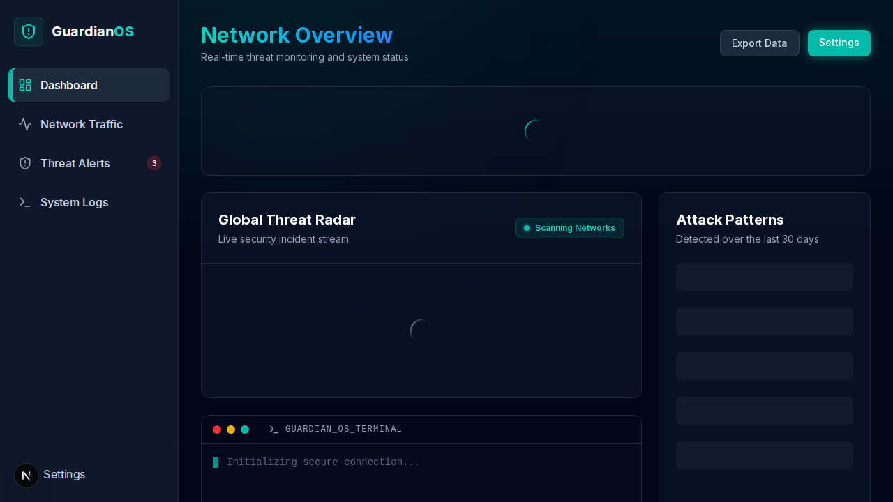
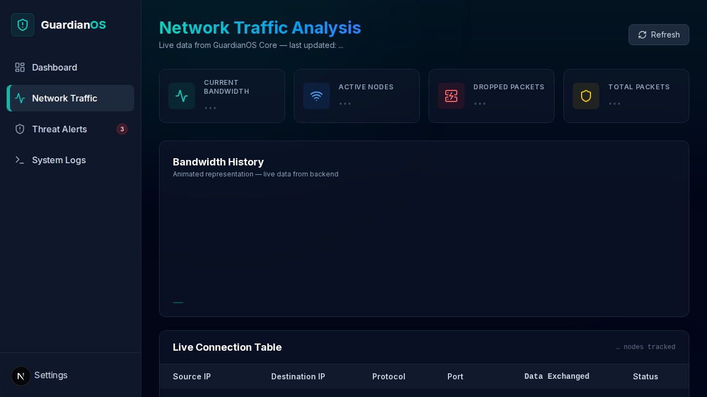
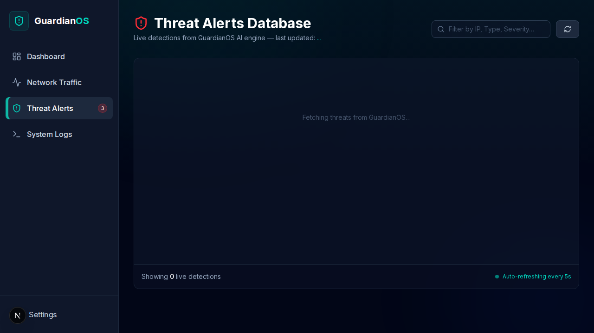
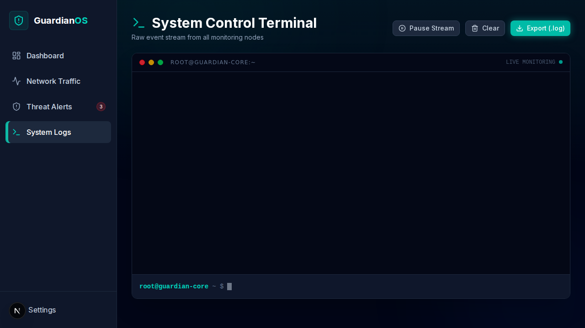
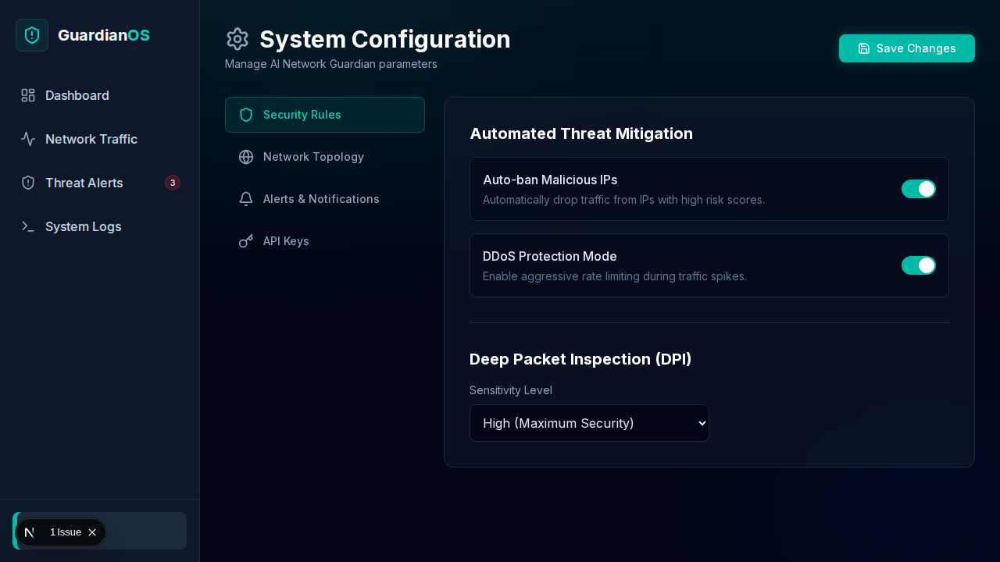

# AI Network Guardian

AI Network Guardian is a full-stack network security monitoring platform with a modern Next.js dashboard and a Python backend for packet capture, feature extraction, and ML-based threat detection.

## Features

- Live network traffic visualization
- Threat alerts and system log views
- API endpoints for traffic, threats, classifications, and logs
- Python modules for capture, extraction, streaming, and detection

## Tech Stack

- Frontend: Next.js, React, Tailwind CSS, TypeScript
- Backend: Python (FastAPI-style routing structure)
- ML/Processing: custom detection and network feature extraction modules

## Project Structure

```text
AI_Network_Guardian/
├── src/                    # Next.js frontend (app router)
│   ├── app/
│   └── components/
├── backend/                # Python backend services
│   ├── api/
│   ├── ml/
│   ├── sniffer/
│   └── streaming/
├── package.json
└── README.md
```

## Run Locally

### 1) Clone

```bash
git clone https://github.com/akramlatif/AI_Network_Guardian.git
cd AI_Network_Guardian
```

### 2) Frontend (Next.js)

```bash
pnpm install
pnpm dev
```

Frontend runs at `http://localhost:3000`.

### 3) Backend (Python)

```bash
cd backend
python3 -m venv .venv
source .venv/bin/activate
pip install -r requirements.txt
python main.py
```

## Dashboard Screenshots

### Home



### Network Traffic



### Threat Alerts



### System Logs



### Settings



## Author

Akram Latif

## License

This project is for educational and research purposes.
